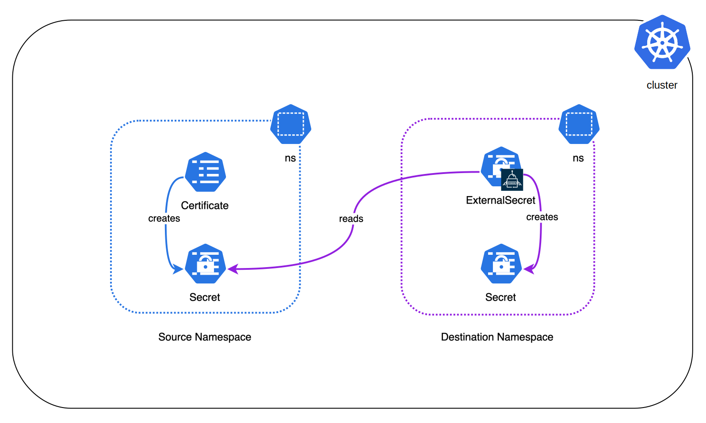

# demo-externalsecret-template

A simple example of an ESO ExternalSecret custom resource using Go templates and an ESO SecretStore Kubernetes Provider to generate kubernetes secrets in a given kubernetes namespace using values from secrets in other namespaces.

## Description

Deployment kustomization for a simple example using the [ExternalSecretOperator](https://external-secrets.io) to obtain- and transform- a secret from another namespace within the same kubernetes cluster, using an ESO [SecretStore](https://external-secrets.io/latest/api/spec/#external-secrets.io/v1beta1.SecretStore) with a [Kubernetes provider](https://external-secrets.io/latest/spec/#external-secrets.io/v1beta1.KubernetesProvider), and an ESO [ExternalSecret](https://external-secrets.io/latest/api/spec/#external-secrets.io/v1beta1.ExternalSecret) using an [ExternalSecretTemplate](https://external-secrets.io/latest/api/spec/#external-secrets.io/v1beta1.ExternalSecretTemplate) with [go-template](https://pkg.go.dev/text/template) expressing the transformation.

External Secrets Operator is a Kubernetes operator that integrates external secret management systems like [AWS Secrets Manager](https://aws.amazon.com/secrets-manager/), [HashiCorp Vault](https://www.vaultproject.io/), [Google Secrets Manager](https://cloud.google.com/secret-manager), [Azure Key Vault](https://azure.microsoft.com/en-us/services/key-vault/), [IBM Cloud Secrets Manager](https://www.ibm.com/cloud/secrets-manager), [CyberArk Conjur](https://www.conjur.org/) and many more. The operator reads information from external APIs and automatically injects the values into a [Kubernetes Secret](https://kubernetes.io/docs/concepts/configuration/secret/).

This example creates a CertManager Certificate in the first namespace causing the generation of a certificate secret, and creates an ExternalSecret in a second namespace causing the generation of another secret bearing the data from the first in a different format. (Availability of the ExternalSecretsOperator and cert-manager operators is a dependency.)

The first (source) secret is structured as follows:

```yaml
apiVersion: v1
data:
  tls.crt: ...
  tls.key: ...
kind: Secret
metadata:
  name: externalsecrets-template-test-source
  namespace: externalsecrets-template-test-source
type: kubernetes.io/tls
```

The second (destination) secret is structured as follows:

```yaml
apiVersion: v1
data:
  ca.crt: ...
  tls.crt: ...
  tls.key: ...
kind: Secret
metadata:
  name: externalsecrets-template-test-dest
  namespace: externalsecrets-template-test-dest
type: kubernetes.io/tls
```

In the destination, the ExternalSecret template restructures the data in the source kubernetes.io/tls-type secret to add the signing CA's certificate as a `ca.crt` key, obtaining its data by parsing the source with the following go-template:

```yaml
spec:
  target:
    template:
      data:
        tls.crt: '{{ $certs := index . "tls.crt" | filterPEM "CERTIFICATE" | splitList "-----END CERTIFICATE-----\n"}}{{ range $index, $element := $certs}}{{- if (eq (int $index) 0)}}{{if $element}}{{$element}}{{"-----END CERTIFICATE-----\n"}}{{end}}{{end}}{{end}}'
        tls.key: '{{ index . "tls.key" }}'
        ca.crt: '{{ $certs := index . "tls.crt" | filterPEM "CERTIFICATE" | splitList "-----END CERTIFICATE-----\n"}}{{ range $index, $element := $certs}}{{- if (ge (int $index) 1)}}{{if $element}}{{$element}}{{"-----END CERTIFICATE-----\n"}}{{end}}{{end}}{{end}}'
```

While this may be fairly brittle as an approach to certificate management, it provides an example of the data processing which can be achieved in ExternalSecret resources in addition to the useful work of simple secret replication from external providers.

## Kubernetes Workload Architecture

[](https://github.com/philip-p-jones/demo-externalsecrets-template)

## Usage

Clone, `kubectl apply -k .`, walk away.

## Roadmap

At this stage, it's just a simple example (see #support).

## Contributing

If you wish to make a change, we'd certainly be grateful for any suggestions and contributions. Feel free to do so in the usual way with [fork-pull](https://docs.github.com/en/pull-requests/collaborating-with-pull-requests/proposing-changes-to-your-work-with-pull-requests/creating-a-pull-request-from-a-fork).

## Support

This demo may still need some work, but no long tail of support was invisaged here. Done for love, not money.
.

## Further Reading

  - [External Secrets Operator](https://external-secrets.io)
  - [Kubernetes Secrets](https://kubernetes.io/docs/concepts/configuration/secret)
  - [cert-manager](https://cert-manager.io)
  - [Go Template](https://pkg.go.dev/text/template)
  - [ESO API Spec: SecretStore](https://external-secrets.io/latest/api/spec/#external-secrets.io/v1beta1.SecretStore)
  - [ESO API Spec: KubernetesProvider](https://external-secrets.io/latest/spec/#external-secrets.io/v1beta1.KubernetesProvider)
  - [ESO API Spec: ExternalSecret](https://external-secrets.io/latest/api/spec/#external-secrets.io/v1beta1.ExternalSecret)
  - [ESO API Spec: ExternalSecretTemplate](https://external-secrets.io/latest/api/spec/#external-secrets.io/v1beta1.ExternalSecretTemplate)
  - [AWS Secrets Manager](https://aws.amazon.com/secrets-manager)
  - [HashiCorp Vault](https://www.vaultproject.io)
  - [Google Secret Manager](https://cloud.google.com/secret-manager)
  - [Azure Key Vault](https://azure.microsoft.com/en-us/services/key-vault)
  - [IBM Cloud Secrets Manager](https://www.ibm.com/cloud/secrets-manager)
  - [CyberArk Conjur](https://www.conjur.org)

## License

This work is licensed under The MIT License.

`SPDX-License-Identifier: MIT`
